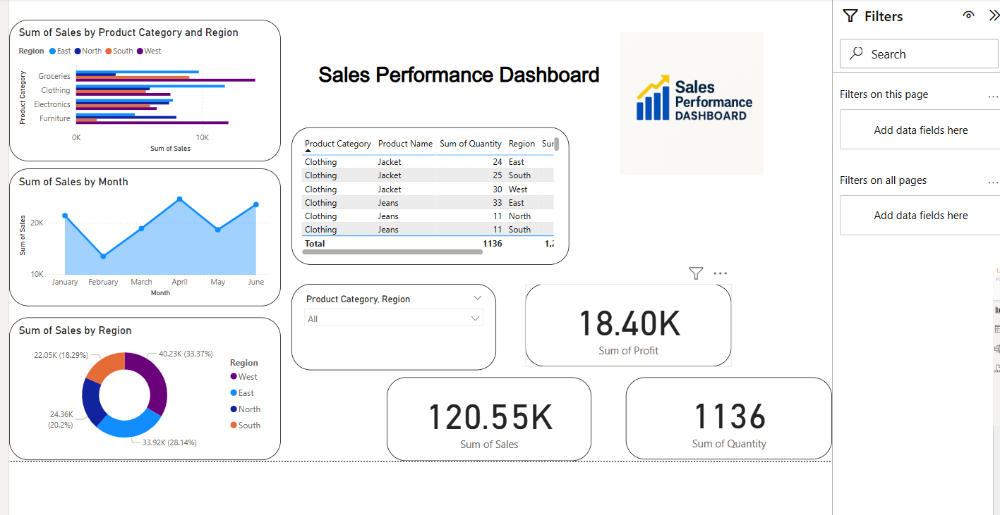

# Sales-Performance-Dashboard
This project presents an interactive Sales Performance Dashboard built using *Microsoft Power BI*. The dashboard helps visualize and analyze sales data across different regions, product categories, and time periods to extract valuable business insights.

---

## 📁 Dataset Used

- *File:* Sales_Data_Dataset.xlsx
- *Columns:*
  - Date
  - Region
  - Product Category
  - Product Name
  - Quantity
  - Sales
  - Profit

---

## 🎯 Objective

- Analyze total sales, profit, and quantity sold
- Compare region-wise and category-wise performance
- Identify top-performing products by profit
- Observe monthly trends and patterns
- Enable dynamic filtering using slicers

---

## 🖥️ Dashboard Features

- 💰 *KPI Cards*: Total Sales, Profit, Quantity
- 📊 *Bar Charts*: Sales by Region & Category
- 📈 *Line Chart*: Sales Trend over Time
- 🍩 *Donut Chart*: Product Category Profit
- 📋 *Table*: Top Products by Sales & Profit
- 🔘 *Slicers*: Region and Product Category
- 🎨 *Custom Styling*: Z-pattern layout, filter panel, rounded visuals

---

## 🖼️ Dashboard Preview

---

## 🧰 Tools & Skills Used

- Microsoft Power BI
- Data Cleaning & Transformation
- Data Modeling & DAX Measures
- Interactive Visualization
- Dashboard Design

---

## 📅 Project Info

- *Project Title:* Sales Performance Dashboard
- *Tool Used:* Microsoft Power BI
- *Domain:* Data Analytics
- *Skills Applied:* Data Cleaning, Visualization
